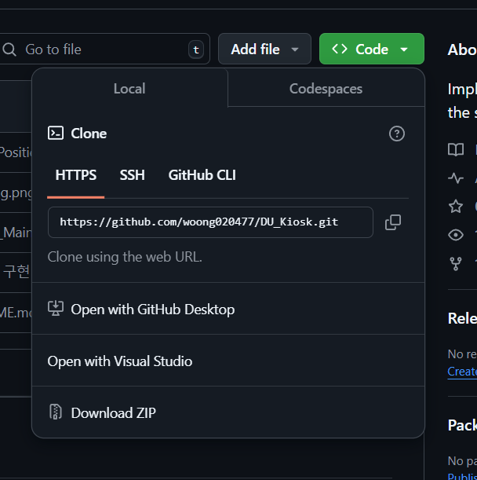

# DU_Kiosk
실행방법  
1. Node.js를 설치한다. [>>설치<<](https://nodejs.org/en/download/prebuilt-installer)
2. 해당 저장소를 C드라이브의 문서/GitHub 폴더에 Clone한다.  
3. 서버) Server 폴더 내 start_server.bat 파일을 실행한다.  
   클라이언트) Client 폴더 내 client_Main.html을 실행한다.  
# 클론방법

